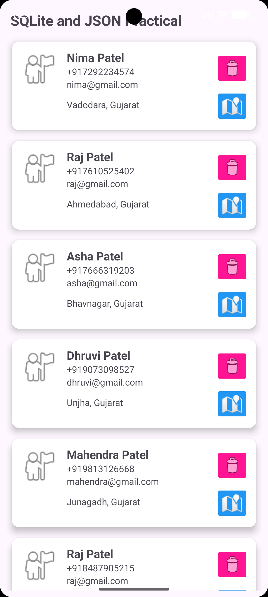
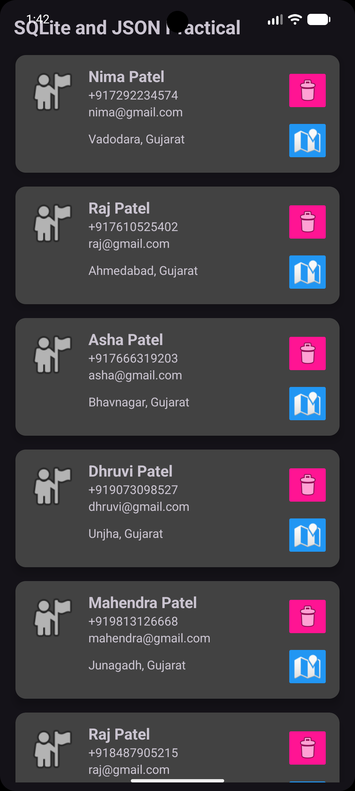

# Practical-7: Fetch JSON Data from Internet API and Store in SQLite

## AIM & Objective

Develop an Android Application that retrieves **person/contact data in JSON format from an Internet API** and stores the retrieved information in an **SQLite database**.

---

## Tools Required

* Android Studio
* Android SDK
* Kotlin
* Internet Connection
* Android Emulator or Android Device
* JSON Generator
* SQLite Database

---

## Concepts & Components Used

* JSON Data
* JSON Parsing
* JSON Generator
* Internet API
* HttpURLConnection
* HTTP GET Request
* HttpRequest Class
* Kotlin Coroutines
* CoroutineScope
* Dispatchers.IO
* RecyclerView
* ListView
* Person Class
* PersonAdapter
* SQLite Database
* SQLiteOpenHelper
* Serializable
* Intent
* Internet Permission
* Background Thread
* Local Data Storage

---

## 7.1 Create JSON Data for Contacts

Create JSON data for contact information using an online JSON generator.

The contact data contains:

* ID
* First Name
* Last Name
* Phone Number
* Email ID
* Address
* Latitude
* Longitude

**JSON Generator:**

https://app.json-generator.com/

The generated URL is used by the Android application to retrieve the JSON data from the Internet.

---

## 7.2 MainActivity

Create `MainActivity` according to the required UI design.

The MainActivity is responsible for:

* Fetching person data from the Internet
* Processing the received JSON data
* Storing the data in SQLite
* Displaying person information

The retrieved records can be displayed using `RecyclerView` or `ListView`.

---

## 7.3 Person Class

Create a `Person` class to store the required information of each person.

The class contains:

```text
id
name
emailId
phoneNo
address
latitude
longitude
```

The `Person` class implements `Serializable` so that Person objects can be passed between Android components when required.

Example:

```kotlin
class Person(
    var id: String,
    var name: String,
    var emailId: String,
    var phoneNo: String,
    var address: String,
    var latitude: Double,
    var longitude: Double
) : Serializable
```

---

## 7.4 JSON Format

JSON stands for **JavaScript Object Notation**.

It is a lightweight format used to exchange structured data between a server and an application.

Example of a person record:

```json
{
    "id": "1",
    "name": {
        "first": "John",
        "last": "Doe"
    },
    "phoneNo": "9876543210",
    "emailId": "john@example.com",
    "address": "Ahmedabad",
    "latitude": 23.0225,
    "longitude": 72.5714
}
```

Multiple person records can be stored in the form of a JSON array.

---

## 7.5 RecyclerView / ListView

The retrieved person information can be displayed using a `RecyclerView` or `ListView`.

### RecyclerView

`RecyclerView` is used to efficiently display a list of person records.

The application uses:

* RecyclerView
* Adapter
* ViewHolder
* Person data list

### Data Flow

```text
JSON Data
    ↓
Person Objects
    ↓
RecyclerView Adapter
    ↓
RecyclerView
    ↓
Person Information
```

`ListView` can also be used as an alternative for displaying the records.

---

## 7.6 Internet Permission

Internet permission must be added to `AndroidManifest.xml` to allow the application to access the Internet.

```xml
<uses-permission android:name="android.permission.INTERNET" />
```

This permission allows the application to communicate with the online API.

---

## 7.7 HttpRequest Class

Create a separate `HttpRequest` class to handle communication with the generated JSON URL.

The class performs the following operations:

1. Creates a URL connection.
2. Opens the connection.
3. Sends the HTTP request.
4. Receives the server response.
5. Reads the JSON data.
6. Returns the response to the application.

### Request Flow

```text
JSON URL
   ↓
HttpRequest
   ↓
HttpURLConnection
   ↓
Internet API
   ↓
JSON Response
   ↓
Application
```

---

## 7.8 HttpURLConnection

`HttpURLConnection` is used to establish an HTTP connection with the web server.

The general process is:

```text
Create URL
     ↓
Open Connection
     ↓
Connect to Server
     ↓
Read Response
     ↓
Convert Response to String
     ↓
Process JSON
```

The received JSON response is then converted into Person objects.

---

## 7.9 CoroutineScope

Kotlin `CoroutineScope` is used to perform network operations in the background without blocking the main UI thread.

`Dispatchers.IO` can be used for Internet and database operations.

### Working Flow

```text
Main Thread
    |
    ↓
Start Coroutine
    |
    ↓
Network Request
    |
    ↓
Receive JSON Data
    |
    ↓
Process Data
    |
    ↓
Update UI
```

Using Coroutines keeps the application responsive while the data is being downloaded.

---

## 7.10 Store Data in SQLite Database

After receiving and processing the JSON data, the person records are stored in an SQLite database.

### Data Flow

```text
Internet API
     ↓
JSON Response
     ↓
JSON Parsing
     ↓
Person Objects
     ↓
SQLite Database
     ↓
RecyclerView / ListView
```

### Database Fields

| Field | Description |
|---|---|
| `id` | Unique person ID |
| `name` | Person's name |
| `emailId` | Email address |
| `phoneNo` | Phone number |
| `address` | Person's address |
| `latitude` | Geographic latitude |
| `longitude` | Geographic longitude |

SQLite allows the retrieved information to be stored locally on the device.

---

## Application Flow

```text
        Start Application
               |
               ↓
          MainActivity
               |
               ↓
        HttpRequest Class
               |
               ↓
        HttpURLConnection
               |
               ↓
          JSON Web URL
               |
               ↓
          JSON Response
               |
               ↓
        Parse JSON Data
               |
               ↓
         Person Objects
               |
               ↓
        SQLite Database
               |
               ↓
       RecyclerView/ListView
               |
               ↓
       Display Person Data
```

---

## Important Components

| Component | Purpose |
|---|---|
| JSON | Represents structured person data |
| JSON Generator | Generates sample JSON data |
| MainActivity | Controls the main application screen |
| Person | Represents person/contact information |
| HttpRequest | Handles communication with the web URL |
| HttpURLConnection | Establishes HTTP connection |
| CoroutineScope | Performs asynchronous operations |
| SQLite | Stores retrieved person data locally |
| SQLiteOpenHelper | Manages the SQLite database |
| RecyclerView | Displays person records |
| ListView | Alternative list display component |
| Serializable | Allows Person objects to be transferred |
| Intent | Used to pass data between activities |
| Internet Permission | Allows Internet access |

---

## Expected Learning Outcomes

After completing this practical, the student will be able to:

1. Understand JSON data format.
2. Generate sample JSON data using a JSON generator.
3. Create a model class for person/contact information.
4. Understand the use of `Serializable`.
5. Retrieve data from an Internet API.
6. Use `HttpURLConnection` for HTTP communication.
7. Create and use an `HttpRequest` class.
8. Use Kotlin `CoroutineScope` for background operations.
9. Parse JSON data into application objects.
10. Store retrieved information in an SQLite database.
11. Display data using `RecyclerView`.
12. Understand `ListView` as an alternative.
13. Add Internet permission in Android Manifest.
14. Understand the complete flow from an Internet API to a local SQLite database.

---

## Output

### Person Data - Light Mode



### Person Data - Dark Mode


---

## Student Details

* **Enrollment No:** 24012011140
* **Practical:** 07
* **Subject:** Mobile Application Development (MAD)

---

## Conclusion

Successfully implemented an Android application that **fetches person/contact data in JSON format from an Internet API, processes the received data, stores it in an SQLite database, and displays the information using RecyclerView/ListView**.

The practical provides hands-on experience with **JSON, HttpURLConnection, CoroutineScope, SQLite, RecyclerView, ListView, Serializable, Internet permissions, and Android data handling**.
```
